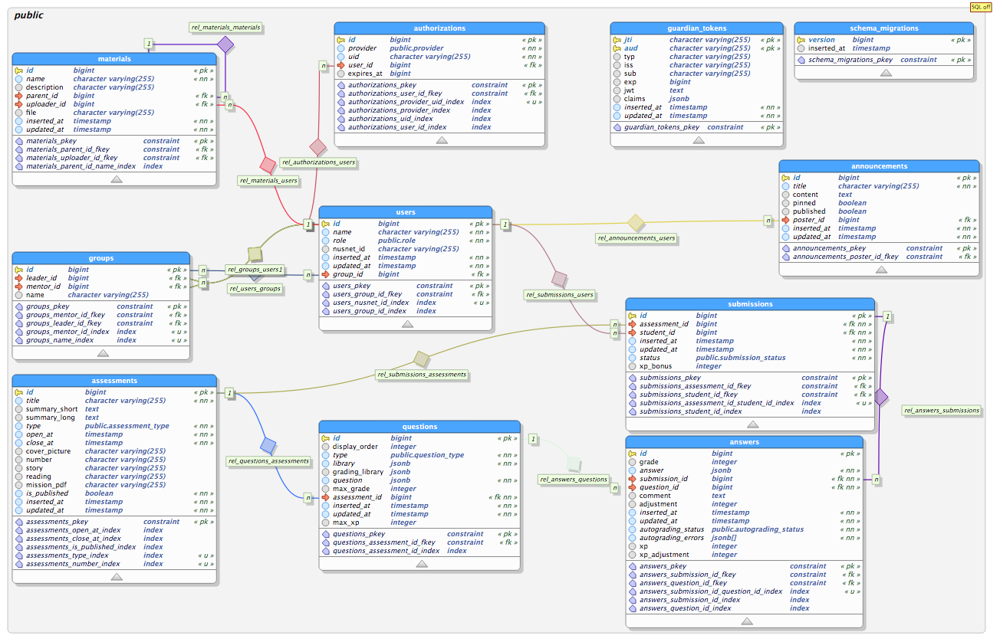

# Cadet

[](https://travis-ci.org/source-academy/backend)
[](https://coveralls.io/github/source-academy/backend?branch=master)
[](http://inch-ci.org/github/source-academy/backend)
[](https://github.com/source-academy/backend/blob/master/LICENSE)

Cadet is the web application powering Source Academy.

- `master` is the main development branch, and may be broken, buggy, unstable, etc. It may not work with the frontend, if there are frontend changes that have not yet been merged.
- `stable` is the stable branch and should work with the stable branch of the frontend. Note that `stable` may not have stable history!

## Developer setup

### System requirements

1. Elixir 1.18+ (current version: 1.18.3)
2. Erlang/OTP 27+ (current version: 27.3.3)
3. PostgreSQL 12+ (tested to be working up to 17)

It is probably okay to use a different version of PostgreSQL or Erlang/OTP, but using a different version of Elixir may result in differences in e.g. `mix format`.

> ## Setting up PostgreSQL
>
> The simplest way to get started is to use Docker. Simply [install Docker](https://docs.docker.com/get-docker/) and run the following command:
> 
> ```bash
> $ docker run --name sa-backend-db -e POSTGRES_HOST_AUTH_METHOD=trust -e -p 5432:5432 -d postgres
> ```
>
> This configures PostgreSQL on port 5432. You can then connect to the database using `localhost:5432` as the host and `postgres` as the username. Note: `-e POSTGRES_HOST_AUTH_METHOD=trust` is used to disable password authentication for local development; since we are only accesing the database locally from our own machine, it is safe to do so.

### Setting up your local development environment

1. Set up the development secrets (replace the values appropriately)

   ```bash
   $ cp config/dev.secrets.exs.example config/dev.secrets.exs
   $ vim config/dev.secrets.exs
   ```

2. Install Elixir dependencies

   ```bash
   $ mix deps.get
   ```

   If you encounter error message `Fail to fetch record for 'hexpm/mime' from registry(using cache insted)`The following instruction may be useful for you.

   ```bash
   $ mix local.hex --force
   ```

3. Initialise development database

   ```bash
   $ mix ecto.setup
   ```

   By default, the database is populated with 10 students and 5 assessments. Each student will have a submission to the corresponding submission. This can be changed in `priv/repo/seeds.exs` with the variables `number_of_students`, `number_of_assessments` and `number_of_questions`. Save the changes and run:

   ```bash
   $ mix ecto.reset
   ```

4. Run the server on your local machine

   ```bash
   $ mix phx.server
   ```

5. You may now make API calls to the server locally via `localhost:4000`. The API documentation can also be accessed at <http://localhost:4000/swagger>.

If you don't need to test MQTT connections for remote execution using [Sling](source-academy/sling), you can stop here. Otherwise, continue to [set up the local development environment with MQTT](#setting-up-a-local-development-environment-with-mqtt-support).

### Setting up a local development environment with MQTT support

In addition to performing the steps [above](#setting-up-your-local-development-environment), you will need to do the following:

1. Set up a local MQTT server.

   One cross-platform solution is Mosquitto. Follow their [instructions](https://mosquitto.org/download/) on how to install it for your system.

2. Update Mosquitto configurations

   We will require two listeners on two different ports: one for listening to the WebSockets connection from Source Academy Frontend, and one to listen for the regular MQTT connection from the EV3. Locate your `mosquitto.conf` file, and add the following lines:

   ```conf
   # Default listener
   listener 1883
   protocol mqtt
   allow_anonymous true

   # MQTT over WebSockets
   listener 9001
   protocol websockets
   allow_anonymous true
   ```

   If necessary, you can change the default port numbers, but it is generally best to stick to the default MQQT/WS ports.

3. Restart the Mosquitto service to apply configuration changes

4. Update configurations in the `config/dev.secrets.exs` file
   Scroll down to the `remote_execution` section near the bottom of the page, uncomment the two keys below, and update their values. Take note that the port numbers should match what you have defined earlier in `mosquitto.conf`.

   - `endpoint_address`: The address the remote device (EV3) should connect to.

     **Example:** `"192.168.139.10:1883"`

   - `ws_endpoint_address`: The address the frontend should connect to.

     **Example:** `"ws://localhost:9001"`

     Take note that you need to include the `ws://` prefix.

   > **Sidenote on connecting from the EV3**
   >
   > Although this value is returned to the remote device, the EV3 uses a hardcoded endpoint value, and simply discards this return value. Hence, the actual value does not matter. However, we still need to set (uncomment) `endpoint_address` to stop the backend from connecting to AWS.

Your backend is now all set up for remote execution using a local MQTT server. To see how to configure the EV3 to use a local MQTT server, check out the [EV3-Source](https://github.com/source-academy/ev3-source) repository.

### Obtaining `access_token` in dev environment

You can obtain an `access_token` JWT for a user with a given role by simply running:

```bash
$ mix cadet.token <role>
```

For more information, run

```bash
$ mix help cadet.token
```

### Style Guide

We follow this style guide: <https://github.com/lexmag/elixir-style-guide> and <https://github.com/christopheradams/elixir_style_guide>

Where there is a conflict between the two, the first one (lexmag) shall be the one followed.

## Entity-Relationship Diagram

Generated with [DBeaver](https://dbeaver.io/) on 19 May 2024



## License

[](https://opensource.org/licenses/Apache-2.0)

All sources in this repository are licensed under the [Apache License Version 2][apache2].

[apache2]: https://www.apache.org/licenses/LICENSE-2.0.txt
