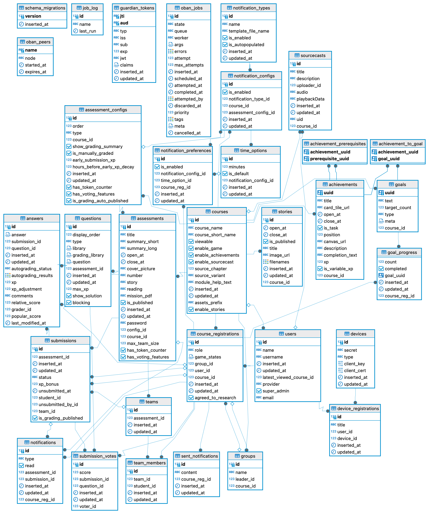

# Cadet

[](https://travis-ci.org/source-academy/cadet)
[](https://coveralls.io/github/source-academy/cadet?branch=master)
[](http://inch-ci.org/github/source-academy/cadet)
[](https://github.com/source-academy/cadet/blob/master/LICENSE)

Cadet is the web application powering Source Academy.

## Developer setup

### System requirements

1. Elixir 1.10.3
2. Erlang/OTP 22.3.4
3. PostgreSQL 11.8

It is probably okay to use a different version of PostgreSQL or Erlang/OTP, but
using a different version of Elixir may result in differences in e.g. `mix
format`.

### Setting up your local development environment

1. Set up the development secrets (replace the values appropriately)

   ```bash
   $ cp config/secrets.exs.example config/secrets.exs
   $ vim config/secrets.exs
   ```

  - To use LumiNUS authentication, specify a valid LumiNUS `api_key`. Note that the frontend will supply the ADFS client ID and redirect URL (so you will need that too, but not here).
  - A valid `cs1101s_repository`, `cs1101s_rsa_key` is required for the
    application to run with the `--updater` flag. Otherwise, you can leave the default values.

2. Install Elixir dependencies

   ```bash
   $ mix deps.get
   ```

3. Initialise development database

   ```bash
   $ mix ecto.setup
   ```

4. Run the server on your local machine

   ```bash
   $ mix phx.server
   ```

5. You may now make API calls to the server locally via `localhost:4000`. The
   API documentation can also be accessed at http://localhost:4000/swagger.


### Obtaining `access_token` in dev environment

You can obtain an `access_token` JWT for a user with a given role by simply
running:

```bash
$ mix cadet.token <role>
```

For more information, run

```bash
$ mix help cadet.token
```

### Style Guide

We follow this style guide: https://github.com/lexmag/elixir-style-guide and https://github.com/christopheradams/elixir_style_guide

Where there is a conflict between the two, the first one (lexmag) shall be the one followed.

## Entity-Relationship Diagram

Generated with [DBeaver](https://dbeaver.io/) on 8 September 2019


